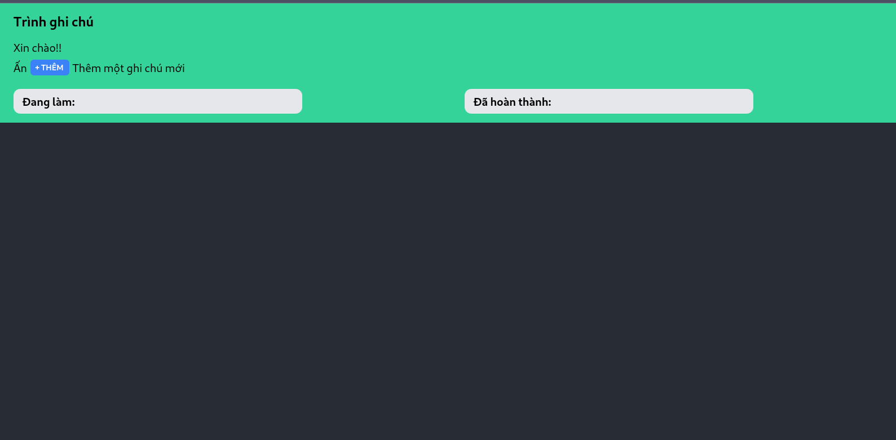
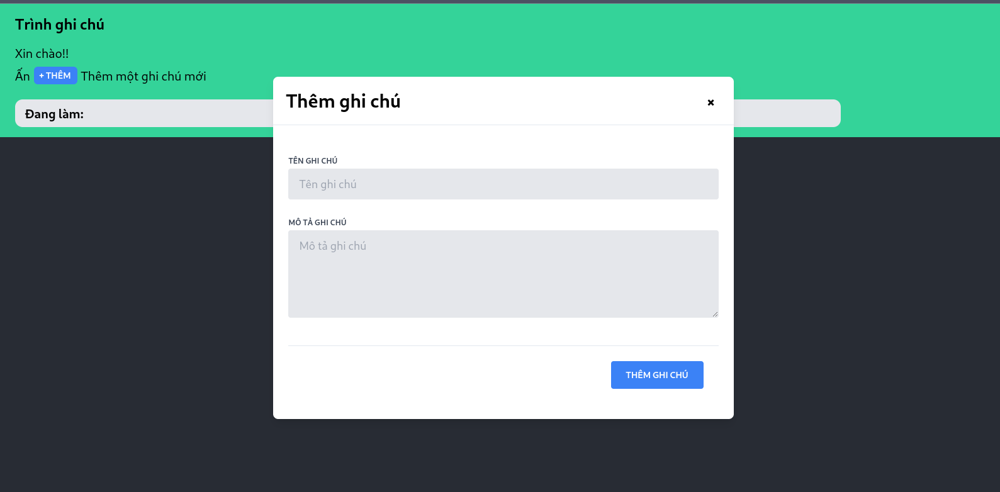
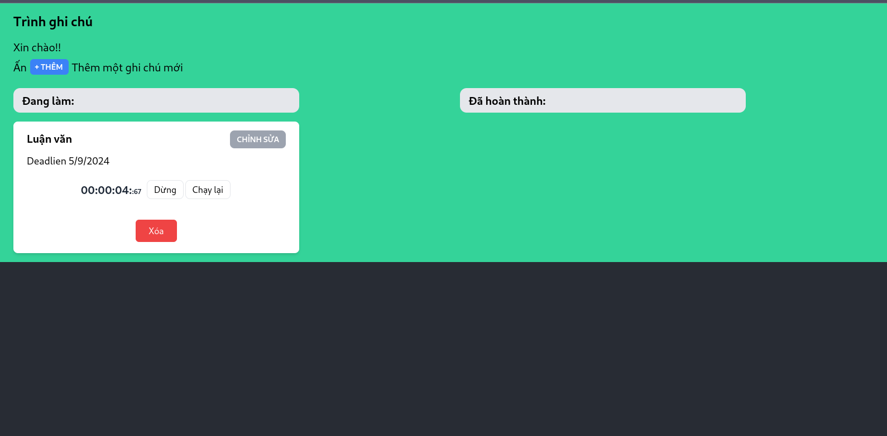
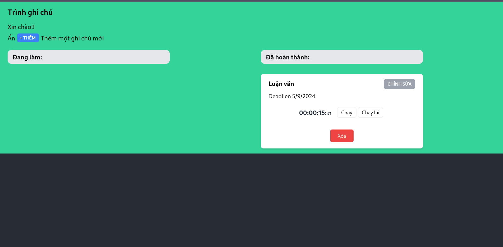
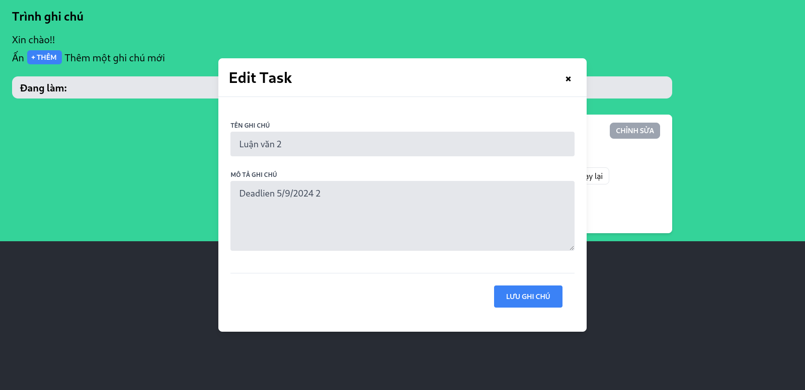
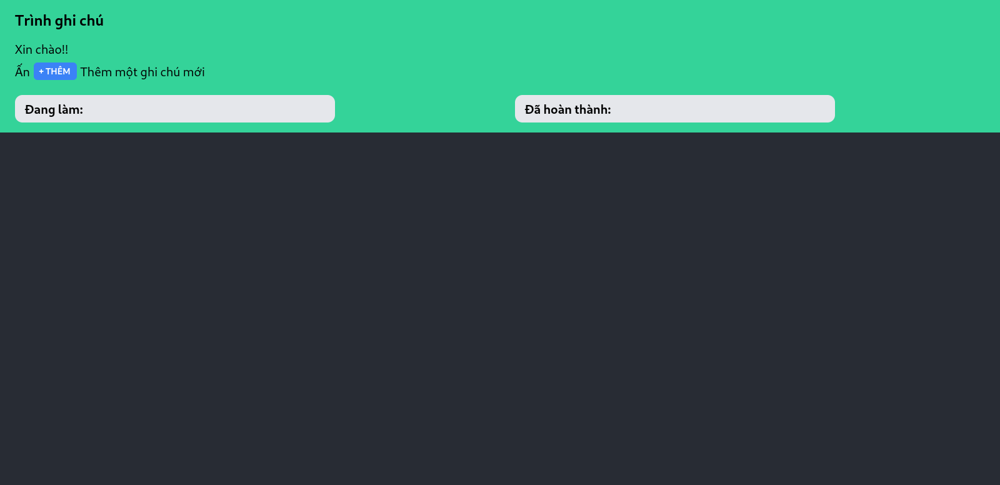

# Trình theo dõi công việc

## Mục lục

- [Giới thiệu](#giới-thiệu)
- [Cài đặt](#cài-đặt)
- [Sử dụng](#sử-dụng)
- [Giao Diện](#giao-diện)
- [Chức năng](#chức-năng)


## Giới thiệu

Trình theo dõi công việc là một công cụ giúp bạn quản lý và theo dõi tiến độ công việc của mình một cách hiệu quả. Dự án này được thiết kế để hỗ trợ người dùng tổ chức và ưu tiên các nhiệm vụ hàng ngày, giúp tăng năng suất và đạt được mục tiêu.

## Cài đặt

Để cài đặt và chạy dự án này, hãy làm theo các bước sau:

1. **Clone kho lưu trữ**:

   ```sh
   git clone <https://github.com/ngtinn59/MiniApp>
   cd task-tracker
   npm install 
## Giao Diện
Trang chủ


Thêm một ghi chú mới



Thêm ghi chú thành công ở mục đang làm


Kéo thả sang đã hoàn thành


Sửa ghi chú


Xóa ghi chú




## Chức năng
Thêm, sửa, xóa, ghi chú, bấm thời gian, kéo thả từ đang làm sang hoàn thành